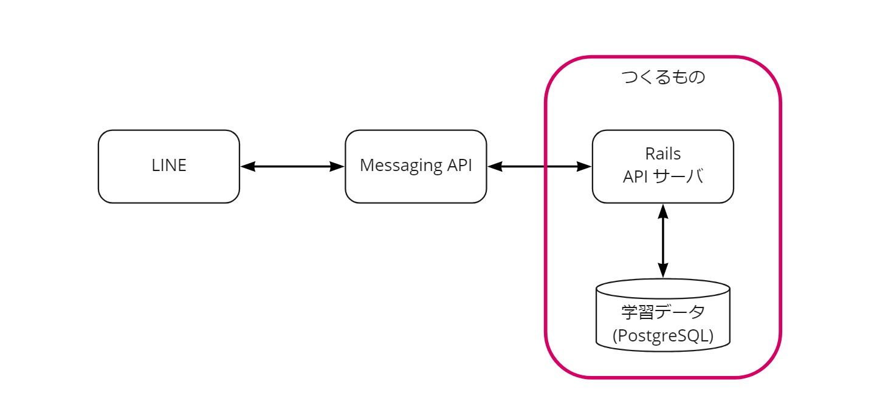

# ruby-bot
黒澤ルビィを作る

[Rubyで黒澤ルビィを作る（Ruby + LINE Messaging API） - Qiita](https://qiita.com/eityans/items/0c1b29f43901a04bd026)



# 開発メモ


## ローカルで動かす
- ローカルでサーバーを起動
```
bundle exec rails s -b 0.0.0.0
```
- ngrok
```
ngrok http -host-header=rewrite 0.0.0.0:3000
```

- [LINEのほうでwebhockのURLを設定する](https://manager.line.biz/account/@940uhfvw/setting/messaging-api)

## コマンド
- migrate
```
heroku run -a peaceful-dusk-72142 rake db:migrate
```


# 環境
[heroku](https://dashboard.heroku.com/apps/peaceful-dusk-72142)